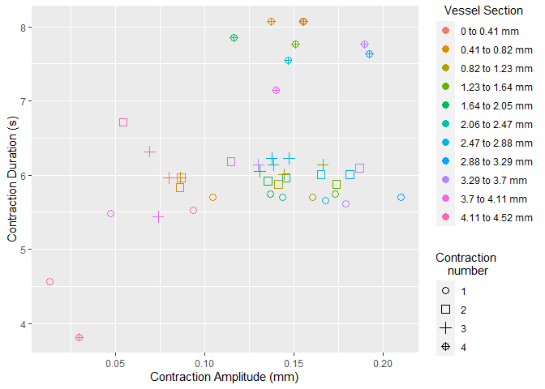

<!-- README.md is generated from README.Rmd. Please edit that file -->

# vmeasur

<!-- badges: start -->
<!-- badges: end -->

The goal of vmeasur is to quantify the contractile nature of vessels
monitored under an operating microscope.

## Installation

You can install the released version of vmeasur from
[CRAN](https://CRAN.R-project.org) with:

``` r
install.packages("vmeasur")
```

And the development version from [GitHub](https://github.com/) with:

``` r
# install.packages("devtools")
devtools::install_github("JamesHucklesby/vmeasur")
```

## Calibrating the operating microscope

To calibrate an operating microscope, take an image of a gradiated
ruler. You can then use this function to calculate the number of pixels
per mm.

``` r
calibrate_pixel_size()
```

## Measuring the vessel diameter

Once video data is collected, the region of interest can be selected
using select\_roi. This provides a wizard that will assist the user
through image analysis.

``` r
select_roi()
```

Once selected, vmeasur can output a variety of important parameters and
graphs


    #> # A tibble: 4 x 12
    #> # Rowwise: 
    #>   event_maxima event_start event_end type     start_value end_value max_value
    #>          <dbl>       <dbl>     <dbl> <chr>          <dbl>     <dbl>     <dbl>
    #> 1          531         472       647 contract        12.9      12.3      3.76
    #> 2          261         195       331 contract        14.7      14.2      5.67
    #> 3          130          67       195 contract        14.6      14.7      5.95
    #> 4          396         331       472 contract        14.2      12.9      6.02
    #> # ... with 5 more variables: baseline_change <dbl>, event_duration <dbl>,
    #> #   cont_duration <dbl>, fill_duration <dbl>, event_gradient <dbl>
    #> # A tibble: 6 x 4
    #>   variable   mean      sd overall           
    #>   <chr>     <dbl>   <dbl> <chr>             
    #> 1 CA       0.12   0.00645 0.12 (0.006448)   
    #> 2 CD       2.77   0.136   2.774 (0.1358)    
    #> 3 CS       0.0434 0.00390 0.04337 (0.003905)
    #> 4 ED       6.36   0.908   6.36 (0.9081)     
    #> 5 EDD      0.193  0.0112  0.1932 (0.0112)   
    #> 6 EDD2     0.185  0.0152  0.1854 (0.01517)
    #>   X.1 y p_width excluded filename
    #> 1   1 1       0    FALSE        1
    #> 2   2 2       0    FALSE        1
    #> 3   3 3       0    FALSE        1
    #> 4   4 4       0    FALSE        1
    #> 5   5 5       0    FALSE        1
    #> 6   6 6       0    FALSE        1



    #> # A tibble: 6 x 15
    #> # Groups:   source_file [6]
    #>   ygroup event_maxima event_start event_end type     start_value end_value
    #>   <chr>         <dbl>       <dbl>     <dbl> <chr>          <dbl>     <dbl>
    #> 1 3               134          62       192 contract       13.2      13.2 
    #> 2 4               130          62       193 contract       12.6      12.7 
    #> 3 2               136          63       193 contract       12.3      12.1 
    #> 4 5               128          63       194 contract        9.97      9.88
    #> 5 1               132          65       191 contract       14.2      14.2 
    #> 6 6               129          66       196 contract       10.5      10.6 
    #> # ... with 8 more variables: max_value <dbl>, baseline_change <dbl>,
    #> #   event_duration <dbl>, cont_duration <dbl>, fill_duration <dbl>,
    #> #   event_gradient <dbl>, source_file <dbl>, cont_id <int>
    #> # A tibble: 6 x 5
    #>   ygroup variable   mean      sd overall          
    #>   <chr>  <chr>     <dbl>   <dbl> <chr>            
    #> 1 1      CA       0.104  0.0345  0.1038 (0.03449) 
    #> 2 1      CD       2.96   0.0913  2.961 (0.0913)   
    #> 3 1      CS       0.0349 0.0105  0.03486 (0.01051)
    #> 4 1      ED       6.38   1.14    6.382 (1.145)    
    #> 5 1      EDD      0.188  0.00948 0.1875 (0.009478)
    #> 6 1      EDD2     0.177  0.0190  0.1768 (0.01904)
